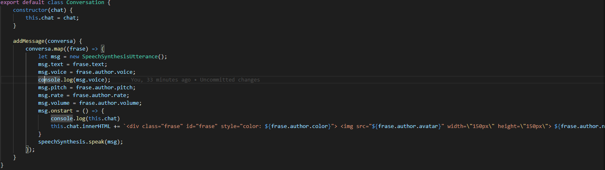

## dsi-p3-synth-alu0100658705
### Pablo Bethencourt Díaz
### alu0100658705@ull.edu.es

## Práctica 3: APIs de Javascript. Práctica Game Dialogue Synth
Veamos como he implementado el fichero *index.js*:

En primer lugar defino 3 variables con los avatares de cada usuario. Luego leo las voces que contiene *speechSynthesis* con el método getVoices() para seleccionar aquellas que se van a pasar a cada usuario, se instancian los perfiles y se llama al método *addMessage* de la clase *Conversation* cuando se hace click en alguno de los botones.

1. **Implementa la clase Profile para definir las características del personaje.**
La clase profile reune los siguientes atributos:

2. **Implementa la clase Conversation para definir la conversación global y su manejo del sintetizador de forma que sea ajeno a la página principal.**

3. **La forma más fácil de implementar el sistema de diálogos es haciendo que muestre cada frase de golpe. ¿Serías capaz de implementarla de forma que aparezca palabra a palabra, a medida que la pronuncia? (Pista: hay que usar eventos)**

No he implementado el método letterToLetter() para que muestre letra a letra.

